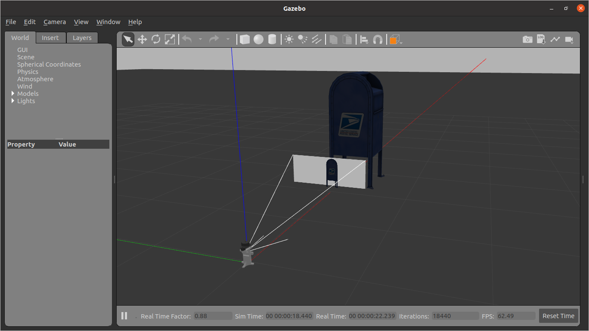

# TechnoYantra Sensor Mount

This package contains the files for ROS integration of Technoyantra Sensors Mount ([ty_sensors_mount](https://github.com/TechnoYantra/ty_sensors_mount)) which is a custom designed & 3D Printed mount which holds various sensors together like

 * RPLiDAR A1 360° Laser Range Scanner - https://www.slamtec.com/en/Lidar/A1
 * Intel® RealSense™ Depth Camera D435 and - https://www.intelrealsense.com/depth-camera-d435/
 * Intel® RealSense™ Tracking Camera T265 - https://www.intelrealsense.com/tracking-camera-t265/

This sensor mount can be placed on your robot to get simultaneous data from all of your sensors.

This package currently supports and is been tested on [ROS2 Foxy Fitzroy](https://docs.ros.org/en/foxy/Installation/Linux-Install-Debians.html) running on Ubuntu 20.04.

## Dependencies:

### ROS on appropriate Ubuntu Version -

Install [ROS2 Foxy Fitzroy](https://docs.ros.org/en/foxy/Installation/Linux-Install-Debians.html), on Ubuntu 20.04 before proceeding. 

### Colcon Workspace -

Create a colcon workspace if not made already, where you can store all your packages. Follow [this tutorial](https://docs.ros.org/en/foxy/Tutorials/Colcon-Tutorial.html) to create your own colcon workspace.

**NOTE:** Please don't make another workspace just for ty_sensors_mount. Keep the package in the same workspace as your robot on which you are going to implement it.

### Git -

Make sure you have Git installed on your PC. If not, then you can install git using

```
sudo apt-get install git
```

## Installation:

To install the ty_sensors_mount package, stay in the src folder of your Colcon Workspace
```
cd colcon_ws/src
```

and then run the following command

```
git clone https://github.com/TechnoYantra/ty_sensors_mount
```

Please run `colcon build --symlink-install` from your workspace directory before proceeding.

And you are done! Don't forget to source the workspace by `source install/setup.bash`. You can now use the ty_sensors_mount package!!!

## How to use:

### As a standalone package -

Run the following command to start a simulation with the ty_sensors_mount in the centre of the world and initializing all the Sensors. It will take a little time to load depending upon your PC specification if you are loading it for the first time


- Add the workspace path to **GAZEBO_MODEL_PATH**
```bash
export GAZEBO_MODEL_PATH=~<pwd>/src/:$GAZEBO_MODEL_PATH

```

- Launch Gazebo with Ty Sensor Mount

```
ros2 launch ty_sensor_mount gazebo.launch.py
```
- Note Remember to change `Reliability Policy` to `Best Effort`

## Result




You can also add few objects in the Simulation from Gazebo Models to test the sensors.

To visualize the data from the sensors, run the following command in another terminal making sure that the simulation is runnning in background.

```
ros2 launch ty_sensor_mount display.launch.py
```

## Result


This will start the RViz2 and load a config file that will help you visualize readings and data from all the sensors.

### On your own Robot -

You can attach this mount to your robot and link the base_link of this mount to the base_link of your robot by publishing the appropriate Static TF.
